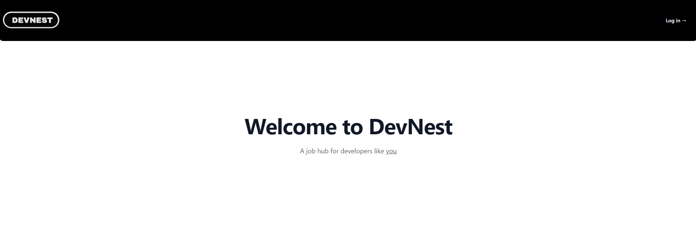
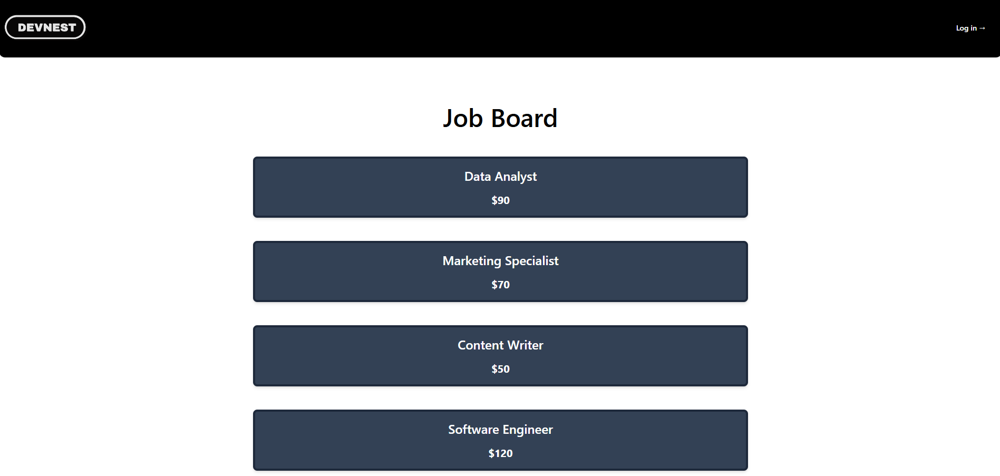
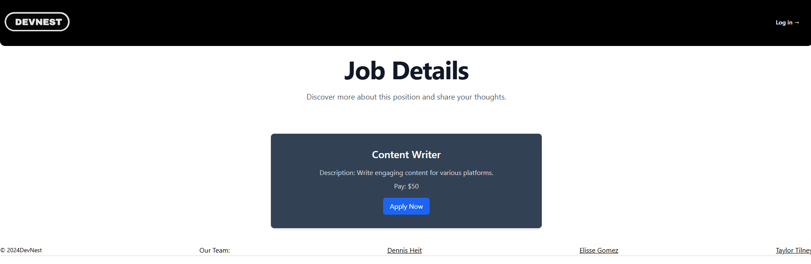

# DevNest- Developer Hire Site

## Project Overview

Developer Hire Site is a full-stack web application that allows developers to create profiles, showcase their skills, connect with other developers, and apply for job opportunities. The platform allows for job searching, messaging, and project sharing, creating a community of developers. It also includes social media features tailored to developers, such as sharing project updates and interacting with others.

## Table of Contents

- [Project Overview](#project-overview)
- [Key Features](#key-features)
- [Technologies Used](#technologies-used)
- [Installation](#installation)
- [Usage](#usage)
- [Authentication](#authentication)
- [Queries and Mutations](#queries-and-mutations)
- [Contributing](#contributing)
- [Screenshots](#screenshots)
- [Deployment](#deployment)
- [Collaborators](#collaborators)
- [License](#license)

## Key Features

- **User Authentication (Sign Up/Login)**: Users can create an account and log in securely using JWT.
- **User Profiles**: Developers can create profiles that showcase their skills, projects, and experience.
- **Job Listings**: Post, browse, and apply for developer-related jobs.
- **Messaging System**: Direct message functionality to connect developers.
- **Social Feed**: Share updates, articles, and projects with other users.
- **Search & Filter**: Search for developers by skill or location and filter job listings.

## Technologies Used

- **Frontend**:

  - React.js
  - CSS
  - GraphQL

- **Backend**:

  - Node.js, Express.js
  - GraphQL
  - MongoDB, Mongoose
  - JWT Authentication

- **Deployment**:
  - Render

## Installation

### Prerequisites

- Node.js (v14 or higher)
- MongoDB (local or cloud)
- Render account (for deployment)

### Steps to Install

1. Clone the repository
2. Navigate into the project directory: cd DevNest
3. Install dependencies: npm install
4. Run seeds for application: npm run seed
5. Build for production: npm run build
6. Start the development server: npm run dev

## Usage

- **Sign Up/Login**: Create a new account or log in.
- **Create Profile**: Customize your developer profile with skills, experience, and portfolio.
- **Explore Jobs**: Browse and apply for jobs, or post job listings if hiring.
- **Messaging**: Connect with other developers via direct messages.
- **Social Feed**: Post updates, articles, and new projects.

## Authentication

The site uses JWT (JSON Web Token) for authentication. When a user logs in or creates an account, a JWT is generated and stored in the browser's local storage. This token is used for subsequent API requests to the server.

## Queries and Mutations

The application uses GraphQL for all data interactions.

### Queries:

- **Get User Profiles:** Retrieve a list of developer profiles.
- **Get Job Listings:** Query all job listings or filter by criteria.
- **Get Social Feed:** Retrieve posts shared by developers.

### Mutations:

- **Add Job:** Create a new job listing.
- **Update Profile:** Update a developer's profile with new information.
- **Post Message:** Send a message to another user.

## Contributing

1. Fork the repository.
2. Create a new branch (`git checkout -b feature-branch`).
3. Commit your changes (`git commit -m "Add new feature"`).
4. Push to the branch (`git push origin feature-branch`).
5. Open a pull request.

## Screenshots

## Deployment

To deploy the application using Render

1. **Push to GitHub**
2. **Deploy on Render**
3. **Access Application**

- Deployed Render Application: https://devnest-ane4.onrender.com 

## Collaborators

1. Aden Neal- https://github.com/adenman
2. Elisse Gomez- https://github.com/elissegomez24
3. Dennis Heit- https://github.com/Mitchell-610
4. Taylor Tilney- https://github.com/TayDeveloping

## License

This project is licensed under the [MIT LICENSE](LICENSE).
